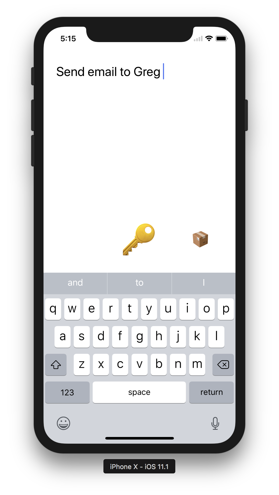

# Major Key

How often are you on the run, or hanging out with friends, only to suddenly think of this really important thing you need to do when you're back home or back at work? 

You want to jot down that thought as quickly as possible so you don't forget, and you want to be reminded. Until now there were a few good ways of doing that:

### Use the Notes app

- Unlock phone
- Launch the notes app
- Navigate to the list of notes
- Tap the `+` button
- Type the note

And end up forgetting to read the note when you're back home

### Send an email to yourself

- Unlock phone
- Launch the mail app
- Enter your email address
- Add a subject (or not and get the extra alert to confirm)
- Type in what you want to remember
- Hit the send button

### IFTTT Note app

This was a great app, launch it, type, confirm, and you have an email in your inbox. However IFTTT discontinued this app.

### New IFTTT app

The new app uses web clips to launch a specific "workflow", which was okayish (added 2 extra seconds each time for the animation + loading), but broke the workflow on the iPhone X, as the task switching gesture would trigger the web clip again, causing the app to launch again

## Introducing Major Key, the best key

With far less than 100 lines of Swift code, this simple app does all you need:

- Unlock phone
- Launch Major Key 🔑
- Type the note
- Confirm

Within a second you'll have the note in your email inbox. Extremely useful if you follow the inbox zero approach.

All with no waiting times or animations.

[**See the app in action**](https://www.youtube.com/watch?v=dOm5H5a8fbY)

## Use the app

- Clone the repo
- You don't need a backend, just create a free SendGrid account
- Get your SendGrid API key and add it to `ViewController.swift`
- Add your email address to `ViewController.swift`
- Install the app on your phone
